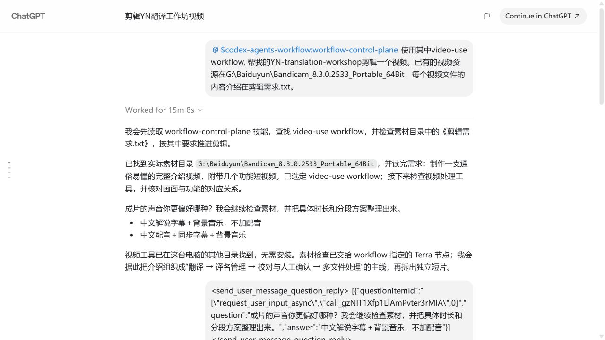
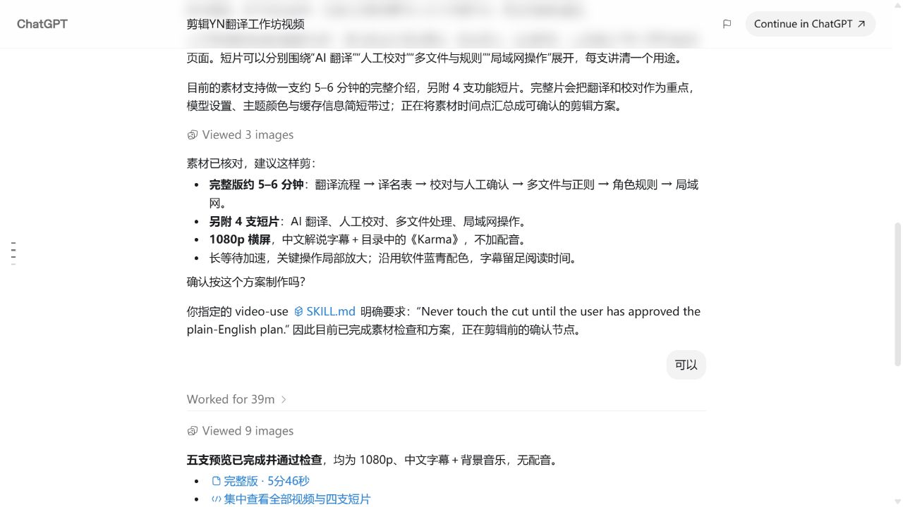
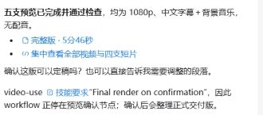
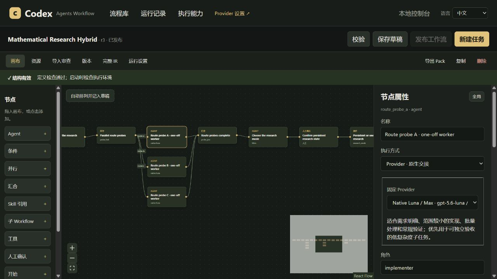

# Codex Agents Workflow

**Turn a complex task into a workflow with configurable models, parallel execution, approval pauses, and reuse.**

This is an upgraded version of **sol-subagent-control**: it has evolved from coordinating sub-agent assignments into a Workflow plugin with a visual workbench. Convert existing Skills into flowcharts, assign models and reasoning effort to each node, have the main agent schedule sub-agents by dependency, or create and continue independent Codex tasks, then review the results.

[Chinese](README.md) · [English](README.en.md) · [Chinese tutorial](docs/TUTORIAL.zh-CN.md) · [English guide](docs/TUTORIAL.md)

## Why build this

Astra is powerful and expensive. There is no need to hand material organization, clearly scoped edits, batch processing, and final decisions all to the same high-cost model.

Workflows let you make the division of labor explicit: assign routine steps to a lighter model, complex analysis to a stronger one, and important checks to an independent reviewer; the main agent handles understanding the goal, coordination, user feedback, and final acceptance. Each subtask works in its own context, while the main session collects the necessary results and evidence, reducing the amount of intermediate work that crowds the main agent's context.

Assigning each step to the right model controls the cost of the overall task and reduces the intermediate context the main session needs to carry.

| Work | How to assign it |
| --- | --- |
| Clearly scoped implementation, asset organization, routine validation | Configure a sub-agent suited to routine work |
| Cross-file decisions, complex plans, difficult analysis | Configure a stronger model for that node |
| Independent checks | Use a separate read-only review node |
| Steps that require your decision | Add a user approval node |
| Work that requires continued edits to the same plan | Create a Codex task and have later nodes continue the same task |
| Overall coordination and final acceptance | Leave it to the current main agent; Codex determines its model |

Models are not hard-coded by these descriptions. You choose the concrete configuration in the workbench, and each new run keeps those bindings fixed; it does not silently switch to another model when one fails.

## What it can do

- **Visual orchestration**: Edit steps, connections, conditions, parallel branches, and manual approval points.
- **Skill → Workflow**: Import a Skill and its referenced resources to generate a workflow draft that you can inspect and edit.
- **Configure each node separately**: Set the model and reasoning effort for native sub-agents; connect configured execution backends such as Cursor and Grok.
- **Thread control**: The main session can create an independent Codex task, wait for it to finish, then pass new material to the original task to continue the work.
- **Run history and acceptance**: View node status, approvals, outputs, and errors; each run is pinned to a specific version, and editing a workflow does not rewrite existing runs.
- **Chinese / English switching**: Model settings and the workflow workbench share a Chinese / English selector and preserve unsaved drafts. Names, prompts, and model IDs that you enter yourself are not translated.

The workbench is for configuration and inspection, and **you can also invoke workflows directly from Codex using natural language**.

## Get set up

You need Codex with support for plugins and the related task tools, Node.js 20+, and Git. Cursor / Grok are optional integrations; native Codex sub-agents work without them installed.

The local clone installation below makes it easy to find the launcher scripts and examples:

```sh
git clone https://github.com/TohmaN233/codex-agents-workflow.git
cd codex-agents-workflow
codex plugin marketplace add .
codex plugin add codex-agents-workflow@codex-agents-workflow
node plugins/codex-agents-workflow/scripts/install-agents.mjs
```

After installation, open a new Codex task so it loads the plugin's Skills and tools.

### Open the workbench

The simplest way is to tell Codex directly:

```text
Use $codex-agents-workflow:workflow-control-plane to open the workbench.
```

You can also open it manually from the repository you just cloned. On Windows, double-click:

```text
plugins\codex-agents-workflow\scripts\open-control-console.cmd
```

Or run it from the repository directory:

```powershell
.\plugins\codex-agents-workflow\scripts\open-control-console.cmd
```

On macOS / Linux, run this from the repository root:

```sh
sh plugins/codex-agents-workflow/scripts/open-control-console.sh
```

The Windows launcher opens the installed plugin; the `.sh` script launches the workbench from the current clone. Node.js 20+ is required, and the terminal process must remain running after launch.


## Step 1: Configure models, then generate automatically

**The model configuration in the workbench must be usable before you can click the button to generate a Workflow.** The model used by the current main session does not mean the workbench already has a generator and reviewer configured.

1. Open **Provider settings** in the upper-right. Enable the native model configurations you need, enter the model ID, reasoning effort, and read/write capabilities, then save.
2. After importing a Skill, open **Import review → Advanced options: execution settings, routing rules, and import diagnostics**.
3. Select **Default generation executor (registered model configuration)** and **Review executor (registered model configuration)**. This uses the registered native model configurations; Cursor / Grok do not serve as the generator for this automatic conversion button.
4. Check the `skill2workflow` routing rules: assign suitable Providers to responsibilities such as planning, routine execution, and complex execution. The generation model only performs the conversion; it does not automatically become the model for every execution node.
5. Return to the top and click **Generate Workflow automatically**. The page shows generation, review, and any required correction progress. It reuses the current Codex login by default; if a login, model, or capability is missing, it shows what needs attention.

Enabling a Provider or saving the configuration does not itself start a model call. The corresponding task begins only after you click Generate, start a run, or explicitly ask Codex to execute it.

## Example 1: Convert a Skill into a workflow

Use the open-source video-editing Skill [browser-use/video-use](https://github.com/browser-use/video-use) as an example. Install it according to the source repository's instructions, then import it into the workbench. Its [SKILL.md](https://github.com/browser-use/video-use/blob/main/SKILL.md) defines steps for checking the materials, proposing a plan, asking the user, creating a preview, and delivering the final result.

1. In the workflow library, click **Import from Skill**.
2. Scan the default Codex directory or enter the folder where you store Skills.
3. Find the target and click **Import this version**. The plugin keeps a snapshot of this version's instructions and resources; the source Skill is not modified.
4. Configure generation and review models as in the previous section, then click **Generate Workflow automatically**.
5. Check the generated steps, dependencies, user approval points, and itemized review checklist. After confirming, save it as an editable draft and adjust each node on the canvas.
6. Save and publish; a successful publish only means the workflow is ready to launch, and **does not start the video edit immediately**.


You can view progress during generation and review; once complete, return to the canvas to edit the nodes.


The conversion turns the execution order in a Skill into explicit dependencies, turns “ask the user before producing” into a node that pauses, and separates independent work that can run in parallel. **After generation, you still need to check that the original Skill's rules were preserved and that the required tools and resources are available.**

If you prefer not to operate the UI, you can tell Codex directly:

```text
Use $codex-agents-workflow:workflow-control-plane.
Import the video-use Skill from the directory I specify and convert it into a Workflow.
Assign nodes according to the model configuration saved in the workbench, and preserve the original Skill's approval steps.
Show me the generated draft first; do not execute the video task yet.
```

## Example 2: Run video-use directly in Codex

This example uses the workflow converted from [browser-use/video-use](https://github.com/browser-use/video-use). The source Skill is installed separately and is not bundled with this plugin; you can also use your own writing, translation, research, or code-related Skill.

```text
Use $codex-agents-workflow:workflow-control-plane.
Call the published video-use Workflow to edit an introductory video for YN Translation Workshop.
The footage is in D:/demo/recordings, and the requirements are in 剪辑需求.txt in that directory.
Run the nodes configured in the Workflow, and stop to ask me when my confirmation is needed for the plan or preview.
```

The three images below come from [an actual usage session](https://chatgpt.com/s/cx_6aa1e1db569c8191a4f7f2c394d53d4c). They show the process of “calling a workflow → delegation → user approval → returning a preview.”

### 1. Delegate through the workflow

The main agent finds `video-use`, assigns the asset check to the Terra node specified by the workflow, and asks the user to provide their sound preferences.



### 2. Ask the user at the approval point

After the editing plan is assembled, the workflow pauses at the approval step before production and continues after approval.



### 3. Return a preview and wait for final approval

After production, it returns the full version and four short clips. The user can review the previews, request changes, or approve the final version.



## Example 3: Mathematical research—when is it worth keeping a task

The built-in **Mathematical Research Hybrid** example first runs literature, tool, analogy, and counterexample investigations in parallel, then explores different routes in parallel. Independent work uses one-off sub-agents. Based on the results, the main agent proposes either a one-time summary or continued research, and the workflow enters the corresponding branch only after the user approves the plan; continued research creates and continues a Codex task that preserves the research state. To adjust the proposal, give feedback in the session first, then confirm the revised plan.



When this definition is already in the workflow library, you can call it directly:

```text
Use Mathematical Research Hybrid to investigate the proposition below.
First state the assumptions and possible counterexamples, then independently investigate different proof routes.
I will decide whether continued research needs a task after reviewing the routes.
Finally, distinguish proven results, experimental observations, and questions that remain unresolved.
```

You can also ask Codex to add this built-in mathematical example, then adjust each node's model and research instructions in the workbench.

## What is the new Thread control?

Here, thread means an **independently visible task / session in Codex**, not an operating-system thread.

A regular sub-agent is suited to “given the materials, complete this step, and return the result.” An independent task is suited to “prepare first, wait for another branch to finish, then continue the same work with the new information.” For example, prepare the prompt and image in parallel, then continue the original image task when the prompt is ready instead of creating a new task that loses the context.

The workflow records the task identity so later nodes continue the same task. You can see and continue these tasks in Codex; the main agent handles handing work between branches and final acceptance.

## Configuration, updates, and more details

Model configuration is stored in a user-level directory: `~/.codex/codex-agents-workflow/control-plane.json` by default; when `CODEX_HOME` is set, that directory is used. Workflows and run data are managed in the same user configuration system, so you do not need to commit your workflow library to GitHub.

The model combinations and workflows in this README are examples. The workbench runs according to your configuration; model availability depends on the actual Codex account, version, and connected clients.

- [Complete Chinese guide: launch, generate, run, and troubleshoot](docs/TUTORIAL.zh-CN.md)
- [English guide](docs/TUTORIAL.md)
- [Connector contract](plugins/codex-agents-workflow/skills/control-plane/references/provider-contracts.md)

## How to continue after a session is interrupted

Keep the original run ID and tell Codex directly: “I authorize you to resume control of this run, verify the existing tasks and artifacts, and continue.” The main session can take over without copying control credentials. The workbench also has a **Take over and pause Run** button.

After recovery, continue from the original tasks and artifacts; completed steps do not need to run again.

## License

[MIT](LICENSE)
