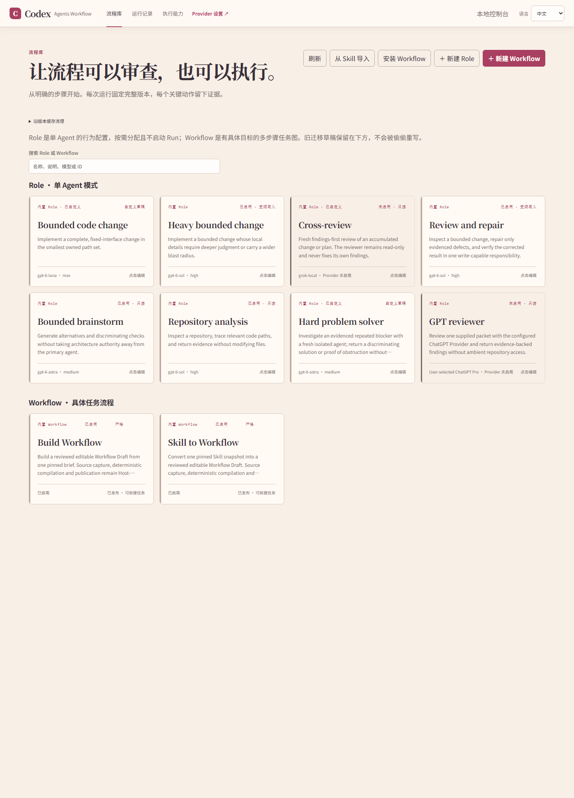
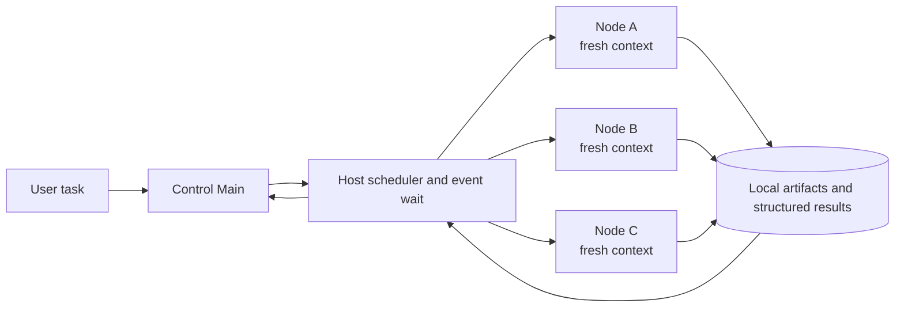
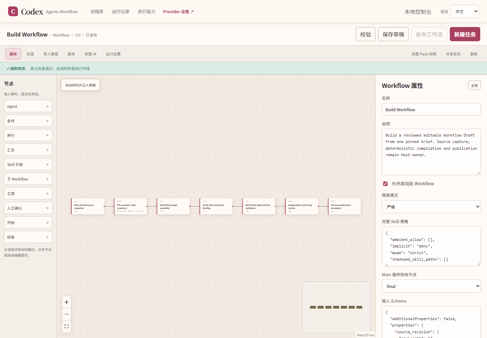

# Codex Agents Workflow

[Project website](https://tgy233.top/tgypage/caw/)

**Turn a growing process prompt into an executable, reviewable, recoverable runtime.**

A process-oriented Skill can tell an agent what to do, but it is still instruction text loaded into model context. As a task grows, the main session carries the user conversation, the complete Skill, intermediate results, and failure history. Delegating steps to subagents does not automatically reduce Main-agent tokens either: if Main keeps polling progress, relaying outputs, and coordinating retries, it continues to spend tokens while the child works.

Codex Agents Workflow separates those responsibilities. A Workflow declares semantic steps and dependencies. The Host owns scheduling, mechanical fields, state, event waits, and recovery. Each agent node receives only the material required for its current step. This is a local workflow runtime, not a wrapper that merely spawns more agents.

[中文](README.md) · [English](README.en.md) · [Guide](docs/TUTORIAL.md) · [Full experiment report](docs/EXPERIMENT_RESULTS.md)

The workbench is now a Codex MCP Extension, so you can manage and run Workflows inside Codex. It is still installed as a Codex plugin: MCP Apps supplies the embedded UI, while Extensions supplies sidebar, settings, and reference entrypoints.



## Why process Skills need a runtime

Skills remain a good fit for a single bounded action. Their limits become visible in workflows with dependencies, fanout, repair, waiting, and persistent state:

- **Prompt text does not isolate context.** Later steps often see unrelated history, source material, and intermediate output.
- **Subagents do not automatically save Main tokens.** Early runs showed Main repeatedly polling while child agents worked; delegation alone did not make Main quiet.
- **Handoffs can become copying work.** Agents reread the same files, relay large outputs, or transcribe IDs, paths, hashes, and bindings.
- **A local failure can expand.** One failed shard should not force nine successful shards to run again.
- **Prompt constraints are not deterministic delivery.** Path resolution, dependency checks, schemas, permissions, artifacts, and recovery points belong in code.

This plugin moves those responsibilities into the Host. When no actionable event exists, Main stops reasoning. The Host holds an event wait for up to one hour and resumes the execution chain immediately when the Run completes, fails, needs attention, receives a subagent result, or records a handoff. The agent does not need a short polling loop to ask whether the work is done.

## What two experiments showed

These are two concrete case studies, not a promise that every Workflow saves tokens. Token totals include cached input. See the [experiment report](docs/EXPERIMENT_RESULTS.md) for arm definitions, judging rules, and results.

### Experiment 1: four simple tasks, with every semantic node running as Main

The tasks and original Skills come from [SkillsBench](https://github.com/benchflow-ai/skillsbench). The [experiment report](docs/EXPERIMENT_RESULTS.md#skill-来源) lists the actual Skill bundles and links to the version used in the experiment.

The Wyckoff-position, earthquake-plate, lake-warming, and video-silence tasks compared:

- `N-main`: Main runs directly, with neither Skill nor Workflow.
- `S-main`: Main runs with the frozen Skill.
- `W-main`: the converted Workflow condition supplies declared process resources as needed, with semantic decisions made by the same Main model.

Every arm used `gpt-5.6-terra / medium`; `W-main` did not gain a cheaper submodel. The 40 valid isolated results include 12 runs in each primary arm and four full-preload Workflow control runs.

| Arm | Mean tokens per run | Mean hidden-test score | Strict passes |
| --- | ---: | ---: | ---: |
| No Skill (`N-main`) | 573,982 | 37.78% | 0/12 |
| Skill (`S-main`) | 527,807 | 97.22% | 9/12 |
| Workflow (`W-main`) | **287,459** | **97.22%** | **9/12** |

At identical measured quality, `W-main` used **45.5% fewer tokens** than `S-main` and **49.9% fewer** than `N-main`. Node-scoped projection also used **31.4% fewer tokens** than the control that preloaded the complete Workflow packet into Main.

### Experiment 2: a 31-card Zenonzard implementation with multiple agents

This experiment used the card-writing Skill from the author's own [ZZ-Project](https://github.com/TohmaN233/ZZ-Project), a project to revive ZENONZARD. The Workflow assigned work across Sol and Luna, then applied a strict card-by-card semantic review.

| Implementation | Valid-result tokens | API-equivalent cost | Strict semantic pass |
| --- | ---: | ---: | ---: |
| Skill | 28,122,593 | $6.9240 | 20/31 (64.52%) |
| Workflow | 33,900,996 | **$3.3929** | **28/31 (90.32%)** |

The selected valid Workflow result used **20.55% more tokens** and improved the strict pass rate by **25.80 percentage points**. At the recorded model prices, its API-equivalent cost was **51.00% lower**. This comparison excludes invalid trials caused by old implementation defects; it is not the total cost of development and debugging. A later source audit corrected the remaining three cards, so the current checkout is 31/31; that later repair does not retroactively change the experimental 28/31 result.

**Using more subagents does not imply fewer total tokens.** Repeated project and task-context reads by the Luna nodes were visible in the ledger. Host-owned silent event waits remove Main's polling cost; they do not erase child reading and reasoning costs. Model routing, review, and repair also changed in this comparison, so neither quality nor price differences can be attributed to context isolation alone.

## How it works


```mermaid
flowchart LR
    U[User task] --> M[Control Main]
    M --> H[Host scheduler and event wait]
    H --> A[Node A<br/>fresh context]
    H --> B[Node B<br/>fresh context]
    H --> C[Node C<br/>fresh context]
    A --> F[(Local artifacts and structured results)]
    B --> F
    C --> F
    F --> H
    H --> M
```

### 1. Node-scoped context isolation

Whether a node uses Main or a native subagent, it receives only its declared inputs, resources, tools, workspace, and references to predecessor results. It does not automatically inherit the parent chat, ambient Skill directories, or raw transcripts from other nodes. Isolating irrelevant material does not remove Codex's basic reading, writing, image, or coding abilities; capabilities required by the task must remain available to the node.

### 2. Host-owned mechanics

Agents return semantic decisions. The Host generates and validates IDs, paths, hashes, node bindings, result schemas, dependency manifests, task packets, and recovery records. A model never has to transcribe random fields, and one malformed character does not justify regenerating an entire graph.

### 3. Silent Main waiting

After delegation, Main yields the wait to the Host. The Host holds an event wait for up to one hour and resumes immediately on an actionable event. A timeout renews the same continuation instead of making Main reread state every few seconds.

### 4. Artifacts stay on disk

Execution nodes write code and outputs directly into the assigned workspace, then return a short status and file location. Large files, full logs, and batch results are not repeatedly relayed through agent messages.

### 5. Retry only the failed unit

Parallel nodes keep separate inputs, attempts, artifacts, and results. Successful shards remain accepted; a repair receives only the failed items and their evidence.

### 6. Roles work automatically in ordinary tasks

A Role is a saved way for Main to call one helper. It says what work fits, which Provider to use, what the helper may change, and what instructions it receives. Once the plugin is loaded, Main automatically selects an enabled Role when delegation would help. The user does not need to name a Role or start a Workflow.

After assigning the work, Main continues anything useful that does not depend on the helper. When the next step does depend on it, Main enters an event wait of up to one hour. Completion, failure, or a request for input wakes Main immediately. Main then inspects the actual changes and verification evidence before accepting the result. The plugin supplies this automatic selection, independent work, silent waiting, and acceptance behavior.

Workflows and Roles stay separate. Main follows the calling chat’s current model and reasoning selection; standalone Workbench launches follow Codex settings, with no fixed plugin Main model. A Workflow node pins its Provider, node task, inputs, and access. Workflow generation may use model suitability to choose a Provider, but a running node never receives another Role prompt. Editing or disabling a Role later cannot change or block an already generated Workflow.

### 7. Threads: continue the same Codex task when needed

Here, a Thread means an independently visible Codex task or chat. It is not an operating-system thread or an ordinary one-shot native subagent. A Thread node must use a native Codex Provider.

A `start` node creates a task and records the exact returned `thread_id`. A later `continue` node must reference a successfully completed upstream Thread node. The runtime uses `send_message_to_thread` to deliver new material to that same task, then uses `wait_threads` and `read_thread` to collect the completion that matches the handoff. Run recovery reconnects to that exact task instead of selecting the most recent conversation or creating a replacement.

Threads are useful when a later stage truly needs the same conversation's internal state—for example, when one task investigates first and continues reasoning after another branch supplies new evidence. They preserve more context and create long-lived visible tasks in the sidebar, so the default Workflows do not use them. Ordinary steps use native agents and local artifact references; custom or generated Workflows can select the Thread `start` and `continue` lifecycles when continuity is required.

## The current workbench

The workbench separates Roles from Workflows. A Role is a directly assignable single-agent behavior profile. A Workflow is a task graph with dependencies, fanout, tools, and human gates. Models, permissions, resources, versions, Run records, and install packages remain inspectable in one place.

The workbench integrates through MCP Apps and OpenAI Extensions, with sidebar and conversation entrypoints plus a separate Provider settings view. Hosts supporting composer mentions can search and reference Workflows or Roles. Full configuration travels in UI-only metadata; the conversation receives compact information. Execution stays with the local Host, and UI capabilities are negotiated rather than tied to an OS or Codex version. [Official extension specification](https://github.com/openai/mcp-extensions/blob/node-v0.1.0/docs/spec.md).



A fresh installation contains two foundational Workflows:

- **Skill to Workflow** converts one pinned Skill snapshot into an editable Workflow.
- **Build Workflow** creates a reviewable, publishable Workflow from a brief.

Math, Zenonzard, and video-use do not populate the default library. They live in the [optional examples directory](plugins/codex-agents-workflow/examples/workflows/README.md), where they can be installed directly or used as references for new Workflow generation.

## Quick start

You need a plugin-capable Codex installation, Node.js 20+, and Git.

Contributors rebuilding the browser UI need Node.js 22+ for the pinned Extensions SDK. Run `npm ci` and `npm run check:web` in `plugins/codex-agents-workflow/control-plane`. The installed Host remains dependency-free on Node.js 20+; its packaged UI already includes the browser SDKs and their licenses.

The workbench supports Windows, macOS, and Linux. Executors check the capabilities exposed by your local Codex installation rather than a fixed release or platform hash. If an upgrade removes a registered path, the Host rediscovers and verifies the local installation. Optional Workflow dependencies are checked separately and do not block unrelated workflows.

```sh
git clone https://github.com/TohmaN233/codex-agents-workflow.git
cd codex-agents-workflow
codex plugin marketplace add .
codex plugin add codex-agents-workflow@codex-agents-workflow
```

After installing or updating, restart the Codex desktop app to reload the plugin entrypoints. In Codex with MCP Apps and Extensions support, open the plugin's workbench entry, or say in your current task:

```text
Use $codex-agents-workflow:workflow-control-plane and open the workbench inside Codex.
```

The embedded view communicates with the Host through Codex; no manual HTTP server or local URL is needed. Open Provider settings from the workbench navigation or the plugin settings entry. Both interfaces share configuration and Run records.

If you want a standalone browser interface, or your host does not support embedded views, explicitly start the local console:

```powershell
.\plugins\codex-agents-workflow\scripts\open-control-console.cmd
```

```sh
sh plugins/codex-agents-workflow/scripts/open-control-console.sh
```

Common entry points:

1. **Existing Skill:** choose “Import from Skill,” pin its source revision, generate a draft, review it, and publish.
2. **Start from a requirement:** open Build Workflow, provide a brief, and edit the Host-compiled graph.
3. **Install an example:** choose “Install Workflow” and select a `*.workflow-package.json` file from `examples/workflows`.
4. **Run directly:** name a published Workflow and task goal in Codex. The Run stops at explicit human gates when a decision is required.

## Release defaults

| Item | Default |
| --- | --- |
| Native Codex Providers | Enabled |
| External Providers | Disabled |
| Cross-review Role | Uses Grok; Role and Provider are disabled by default and enabled separately |
| GPT reviewer Role | Disabled; reuses the `chatgpt-web-pro` Provider |
| Built-in Workflows | Skill to Workflow, Build Workflow |
| Math / Zenonzard / video-use | Optional installs |

## Boundaries

- The four simple tasks and Zenonzard are case studies, not evidence that every Workflow saves tokens.
- A complex multi-agent Workflow may spend more tokens to gain quality, concurrency, or lower monetary cost; Zenonzard is the counterexample.
- Threads are reserved for processes that genuinely need the same visible conversation state across stages. Ordinary work defaults to native agents and local artifact handoffs.
- Strict mode excludes unrelated context and ambient Skills; it does not remove basic capabilities required to complete a node.

Further reading: [full experiment data](docs/EXPERIMENT_RESULTS.md) · [guide](docs/TUTORIAL.md) · [Provider contracts](plugins/codex-agents-workflow/skills/control-plane/references/provider-contracts.md)

## License

[MIT](LICENSE)
