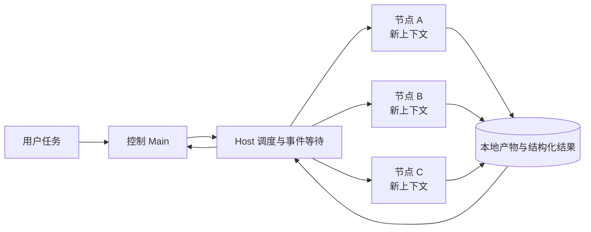

# Codex Agents Workflow

**把流程从一段越来越长的提示词，变成可执行、可审查、可恢复的运行时。**

流程型 Skill 很擅长告诉 Agent“应该怎么做”，但它仍然是一份进入模型上下文的说明。任务一长，主会话会同时背着用户对话、完整 Skill、所有中间结果和错误历史继续工作。即使把步骤交给子 Agent，主 Agent 如果反复轮询进度、转抄结果和处理重试，它自己的 token 也未必下降。

Codex Agents Workflow 把这些职责拆开：Workflow 描述语义步骤和依赖；Host 负责调度、机械字段、状态、事件等待和恢复；每个 Agent 节点只获得当前步骤所需的材料。它不是“多叫几个 Agent”的包装，而是一套控制上下文和执行边界的本地工作流运行时。

[中文](README.md) · [English](README.en.md) · [操作教程](docs/TUTORIAL.zh-CN.md) · [完整实验报告](docs/EXPERIMENT_RESULTS.md)


## 为什么流程型 Skill 需要运行时

当任务只有一个明确动作时，Skill 通常已经足够。问题出现在有依赖、并行、返修、等待和长期状态的流程里：

- **提示词不会自动隔离上下文。** 后续步骤经常重新看到与自己无关的历史、素材和中间输出。
- **子 Agent 不会自动节约 Main token。** 早期运行中，Main 为了等子 Agent 完成而持续轮询；“已经委派”并不等于“Main 已停止消耗”。
- **交接容易变成复制工作。** Agent 重读相同文件、把大段结果传回 Main，或手抄 ID、路径、哈希和绑定字段。
- **提示词约束不是确定性交付。** 路径解析、依赖检查、schema、权限、结果文件和恢复点应该由程序处理。

这个插件把上述问题放进 Host：Main 在没有新事件时不继续推理；Host 持有最长一小时的事件等待，并在 Run 完成、失败、需要处理、子 Agent 返回或 handoff 出现时立即继续。Agent 不需要用短间隔轮询来“看看做完没有”。

## 实验证据

这些是两个具体案例，不是“Workflow 对任何任务都一定省 token”的承诺。Token 包含缓存输入；详细分组、判分方法和结果见[实验报告](docs/EXPERIMENT_RESULTS.md)。

### 实验一：四个简单任务，全部语义节点都使用 Main

四个任务及原始 Skill 资源来自 [SkillsBench](https://github.com/benchflow-ai/skillsbench)，实际 Skill 组合与固定版本的原始链接见[实验报告](docs/EXPERIMENT_RESULTS.md#skill-来源)。

Wyckoff 晶位分析、地震板块计算、湖泊升温归因和视频静音移除分别比较了：

- `N-main`：Main 直接执行，没有 Skill，也没有 Workflow。
- `S-main`：Main 加载冻结 Skill 后执行。
- `W-main`：转换后的 Workflow 条件，按需提供声明的流程资源，语义判断使用相同的 Main 模型。

所有组都使用 `gpt-5.6-terra / medium`；`W-main` 没有换用便宜子模型。40 个有效隔离结果中，主要三组各有 12 次运行。


| 组别                  | 每次运行平均 Token | 平均隐藏测试得分   | 严格通过     |
| ------------------- | ------------ | ---------- | -------- |
| No Skill (`N-main`) | 573,982      | 37.78%     | 0/12     |
| Skill (`S-main`)    | 527,807      | 97.22%     | 9/12     |
| Workflow (`W-main`) | **287,459**  | **97.22%** | **9/12** |


在质量结果相同的情况下，`W-main` 比 `S-main` 少 **45.5%** token，比 `N-main` 少 **49.9%**。

### 实验二：Zenonzard 31 卡，使用多 Agent 完成长流程

本实验使用作者自行开发、用于复活 ZENONZARD 的 [ZZ-Project](https://github.com/TohmaN233/ZZ-Project) 项目所用的写卡 Skill。Workflow 使用 Sol 与 Luna 分工，并对 31 张卡执行逐卡严格语意审查。


| 实现       | 有效结果 Token | API 等价成本    | 严格语意通过            |
| -------- | ---------- | ----------- | ----------------- |
| Skill    | 28,122,593 | $6.9240     | 20/31（64.52%）     |
| Workflow | 33,900,996 | **$3.3929** | **28/31（90.32%）** |


选定有效 Workflow 结果的 token **增加了 20.55%**，严格通过率提高 **25.80 个百分点**；按实验记录的模型价格计算，API 等价成本降低 **51.00%**。该口径排除旧版本缺陷导致的无效试验，不表示开发和全部调试尝试的总成本。

Luna 节点重复读取项目和任务材料产生了可见开销。Host 静默等待消除了 Main 的轮询工作；子 Agent 的读取和推理仍有成本。此例同时改变了模型分工、审查和返修过程，因此质量与价格变化不能单独归因于上下文隔离。

## 它怎样工作




### 1. 节点级上下文隔离

无论节点由 Main 还是原生子 Agent 执行，它只收到声明的输入、资源、工具、工作目录和前置结果引用。它不会自动继承父聊天、环境 Skill 目录或其他节点的原始对话。隔离无关内容不等于削弱 Codex 的基本读写、看图或代码能力；任务需要的能力必须随节点正常提供。

### 2. Host 负责机械工作

Agent 输出语义决定。Host 生成和校验 ID、路径、哈希、节点绑定、结果 schema、依赖清单、任务包和恢复信息。模型不需要手抄随机字段，也不会因为一个字符错误重新生成整个流程。

### 3. Main 静默等待事件

委派完成后，Main 把等待交给 Host。Host 使用最长一小时的事件等待；可处理事件出现时立即唤醒执行链。超时只会续接同一个等待，不会让 Main 每隔几十秒读取一次状态。

### 4. 结果落盘，交接只传引用

执行节点直接把代码和产物写入指定工作区，返回简短状态与文件位置。大文件、完整日志和批量结果不通过 Agent 消息反复搬运。

### 5. 保留成功，只返修失败单元

并行节点分别记录输入、尝试、产物和结果。某个分片失败时，成功分片继续保留；重试只接收失败项及其证据。

### 6. Role 会在普通任务中自动工作

Role 是工作台保存的一种“怎么叫帮手”的设置：它说明适合做什么、使用哪个 Provider、允许改什么，以及交给这个帮手的工作要求。插件加载后，Main 遇到适合委派的普通任务会自动选择已启用的 Role，用户不需要先说“使用某个 Role”，也不需要启动 Workflow。

Main 发出任务后会先完成仍可独立推进的工作；下一步依赖帮手结果时，它进入最长一小时的事件等待。帮手完成、失败或需要输入会立即唤醒 Main。Main 随后检查真实改动和验证结果，再决定是否接收。这套自动选择、继续独立工作、静默等待和验收行为由插件提供。

Workflow 与 Role 分开。主 Agent 沿用启动聊天当前使用的模型和思考强度；独立从工作台启动时沿用 Codex 设置，不设插件固定主模型。Workflow 节点只固定 Provider、节点任务、输入和权限。生成 Workflow 时可以参考不同工作的模型适用范围来选择 Provider；运行节点时不会再注入 Role 指令，也不会因为后来编辑或关闭某个 Role 而改变或阻塞已经生成的 Workflow。

### 7. Thread：需要时延续同一个 Codex task

这里的 Thread 指 Codex 中独立可见的 task / chat，不是操作系统线程，也不是普通的一次性原生子 Agent。Thread 节点必须使用原生 Codex Provider。

`start` 节点创建一个新 task，并记录返回的准确 `thread_id`。后续 `continue` 节点必须引用一个已经成功完成的上游 Thread 节点；运行时使用 `send_message_to_thread` 把新材料交给同一个 task，再通过 `wait_threads` 和 `read_thread` 接收与该次交接匹配的完成结果。恢复 Run 时也会重新连接这个准确的 task，不会选择“最近的”会话或创建替代 task。

Thread 适合后续阶段确实需要同一会话内部状态的流程，例如先调查，等其他分支提供新证据后，再让原 task 继续推理。它会保留更多上下文，也会在侧边栏产生长期可见的 task，因此默认 Workflow 不使用它。普通步骤继续使用原生 Agent 和本地产物引用；自定义或生成的 Workflow 可以在需要时选择 Thread 的 `start` / `continue` 生命周期。

## 工作台

工作台把 Role 与 Workflow 分开：Role 是可直接分配的单 Agent 行为配置；Workflow 是包含依赖、并行、工具和确认点的任务图。模型、权限、资源、版本、运行记录和安装包都能在同一处检查。

工作台通过 MCP Apps 和 OpenAI Extensions 接入宿主：可从侧栏或当前对话打开，Provider 设置也有独立入口。支持 composer mentions 的客户端可搜索并引用 Workflow 或 Role。完整配置通过 UI 专用数据传递，聊天只收到简要信息；执行仍由本地 Host 管理。界面功能按宿主能力启用，不绑定操作系统或 Codex 版本。[官方扩展规范](https://github.com/openai/mcp-extensions/blob/node-v0.1.0/docs/spec.md)


安装只提供两个基础 Workflow：

- **Skill to Workflow**：把固定 Skill 快照转换为可编辑 Workflow。
- **Build Workflow**：从 brief 创建可审查、可发布的 Workflow。

作者自己在开发时测试的workflow位于[可选示例目录](plugins/codex-agents-workflow/examples/workflows/README.md)，想尝试的话可安装，也可以作为生成新 Workflow 的参考。

## 快速开始

需要支持插件的 Codex、Node.js 20+ 与 Git。

开发者重新构建浏览器界面时，需要 Node.js 22+，在 `plugins/codex-agents-workflow/control-plane` 执行 `npm ci` 和 `npm run check:web`。已安装的 Host 仍支持 Node.js 20+，无需安装 SDK 依赖；界面包已包含浏览器 SDK 及其许可证。

工作台支持 Windows、macOS 和 Linux。执行器根据本机 Codex 提供的实际协议能力检查兼容性，不锁定某个 Codex 版本或平台哈希。Codex 升级导致旧路径失效时，Host 会重新发现并验证本机安装。特定 Workflow 的可选依赖单独检查，不阻塞其他流程。

```sh
git clone https://github.com/TohmaN233/codex-agents-workflow.git
cd codex-agents-workflow
codex plugin marketplace add .
codex plugin add codex-agents-workflow@codex-agents-workflow
```

安装后在支持 MCP Apps 的 Codex 中，从插件侧栏入口打开工作台，或在当前 task 直接说：

```text
使用 $codex-agents-workflow:workflow-control-plane，打开工作台。
```

需要独立浏览器界面时，也可以手动启动本地控制台：

```powershell
.\plugins\codex-agents-workflow\scripts\open-control-console.cmd
```

```sh
sh plugins/codex-agents-workflow/scripts/open-control-console.sh
```

常见入口：

1. **已有 Skill**：点击“从 Skill 导入”，固定来源版本，生成草稿，审查后发布。
2. **从需求开始**：打开 Build Workflow，输入 brief，再编辑 Host 编译出的流程图。
3. **安装示例**：点击“安装 Workflow”，选择 `examples/workflows` 下的 `*.workflow-package.json`。
4. **直接运行**：在 Codex 中说明要使用的已发布 Workflow 和任务目标；需要人工确认时，Run 会停在明确的确认点。


## 默认发布配置


| 项目                           | 默认状态                             |
| ---------------------------- | -------------------------------- |
| 原生 Codex Provider            | 开启                               |
| 外部 Provider                  | 关闭                               |
| Cross-review Role            | 使用 Grok；Role 与 Provider 默认关闭，可分别启用 |
| GPT reviewer Role            | 关闭；复用 `chatgpt-web-pro` Provider |
| 内置 Workflow                  | Skill to Workflow、Build Workflow |
| Math / Zenonzard / video-use | 可选安装                             |


## 边界

- 四个简单任务和 Zenonzard 都是案例研究，不能推出所有 Workflow 都节约 token。
- 复杂多 Agent Workflow 可能为了质量、并行或更低价格而使用更多 token。
- Thread 只用于确实需要跨阶段保留同一会话状态的流程。普通工作默认使用原生 Agent 和本地产物交接。

进一步阅读：[完整实验数据](docs/EXPERIMENT_RESULTS.md) · [中文教程](docs/TUTORIAL.zh-CN.md) · [Provider 契约](plugins/codex-agents-workflow/skills/control-plane/references/provider-contracts.md)

## License

[MIT](LICENSE)
