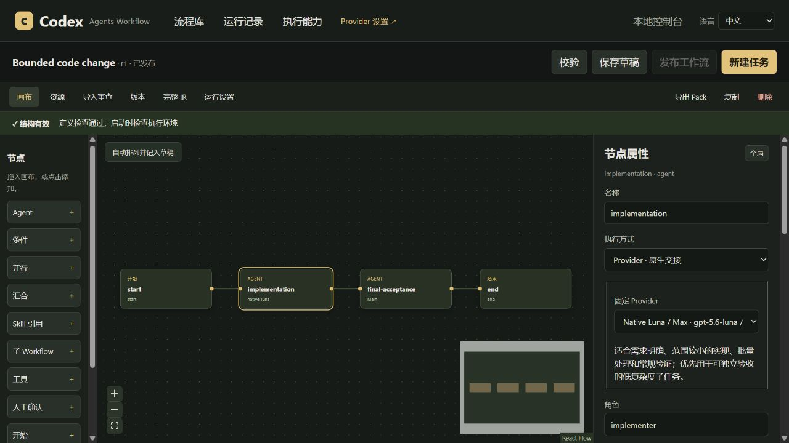
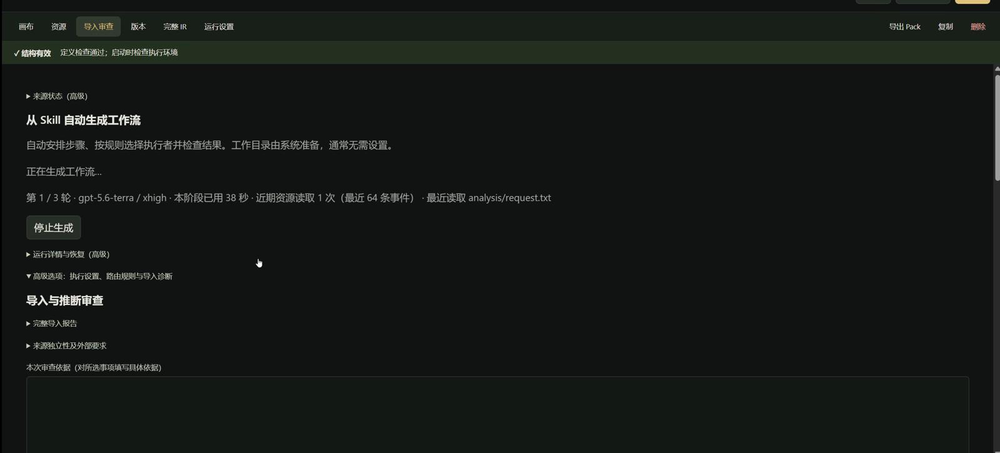
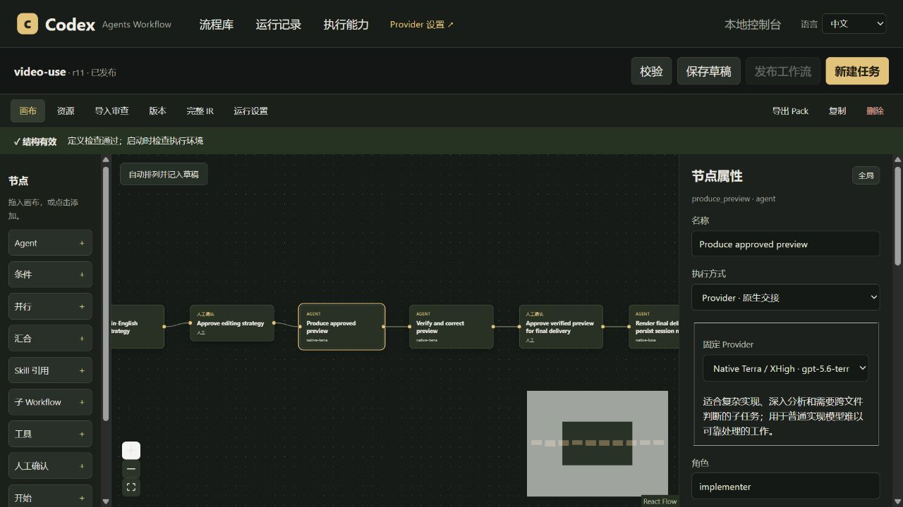

# 工作台操作教程

[返回 README](../README.md) · [English](TUTORIAL.md)

在工作台中配置模型、导入 Skill，并把流程用于实际任务。

## 1. 安装与第一次打开

按 [README 的安装步骤](../README.md#先装起来)安装，随后新建 Codex task。

直接对 Codex 说：

~~~text
使用 $codex-agents-workflow:workflow-control-plane，打开工作台。
~~~

Windows 从克隆的仓库根目录运行：

~~~powershell
.\plugins\codex-agents-workflow\scripts\open-control-console.cmd
~~~

启动器根据 Codex 安装记录选择插件版本，在本机端口 58712 打开带认证的页面。不要从缓存目录猜一个“最新版本”，也不要公开分享启动器给出的含 token 的地址。保持启动器进程运行。

macOS / Linux 可从仓库根目录启动：

~~~sh
./plugins/codex-agents-workflow/scripts/open-control-console.sh
~~~

该脚本从源码目录启动工作台，需要 Node.js 20+。

默认进入流程库；Provider 设置在导航中。中文 / English 选择保存在浏览器，两个页面同步，不会保存配置或丢弃未保存草稿。

## 2. 区分三种模型配置

| 配置 | 负责什么 | 在哪里改 |
| --- | --- | --- |
| 主 Agent 的模型 | 理解用户目标、控制流程、验收 | Codex 当前 task 的模型设置 |
| 生成器 / 审核器 | 把 Skill 转成 Workflow，并检查转换结果 | 导入审查的高级选项中选择已注册原生配置 |
| 工作流节点的 Provider | 真正执行该节点的任务 | Provider 设置定义模型；画布节点固定绑定 |

生成模型不等于执行模型。不要为了用强模型拆解 Skill，就把整理材料等所有执行步骤都交给它。

在 **Provider 设置** 中启用所需配置，填写原生模型 ID、推理强度、用途说明和读写能力，然后保存。用途说明帮助自动路由判断哪些节点适合这个配置。

Cursor / Grok 属于额外执行端，需要相应客户端和连接条件。Cursor CDP 使用客户端的模型设置，插件没有对应的本地模型选择器；它不继承 Codex 主 Agent 的模型。当前 Skill 自动生成按钮的生成器和审核器使用已注册原生配置，不支持把这些客户端直接当作转换执行器。

仅打开工作台、启用 Provider 或保存配置不会调用模型。

## 3. 从 Skill 开始

1. 点击 **从 Skill 导入**，扫描默认目录或填写自己的绝对文件夹路径。
2. 在结果里核对名称和路径，再选择 **导入此版本**。缓存可能有多个版本，导入的是你选中的版本。
3. 打开 **导入审查**。先看来源、资源和待处理事项。
4. 展开 **高级选项：执行设置、路由规则与导入诊断**。
5. 选择 **默认生成执行者（已注册模型配置）** 和 **审核执行者（已注册模型配置）**，检查 skill2workflow 路由规则。模型名称与推理强度在 Provider 设置里编辑。
6. 点击 **自动生成 Workflow**。工作目录通常自动准备；默认复用现有 Codex 登录。
7. 查看生成的步骤、连线、人工确认点和审核证据。通过模型审核不等于已经完成原来的业务任务。
8. 确认后保存为可编辑草稿，再在画布调整。

*作者提供的旧版录屏节选，显示生成进行中；当前界面已支持中英切换。*

Skill 的指令与相关资源会形成固定快照。导入不修改原文件，也不自动安装 Skill 要求的外部程序。更新源 Skill 后，已有 Run 仍使用原先固定的版本。

**检查转换时，重点看这些内容：**

- 先后顺序是否符合原 Skill；真正独立的工作才并行。
- 硬性规则、验收标准与用户确认点是否保留。
- 哪些步骤交给主 Agent、一次性子 Agent或独立 task，是否合理。
- 输入与上游输出是否接对；不能凭空编造用户要求。
- 外部工具、文件和服务是否仍然可用。

## 4. 保存、发布与执行是三件事

**保存**保留编辑。**发布**验证并固定可启动的版本。**启动**创建一次新的 Run，开始为具体任务工作。

你可以在工作台发布后填写本次任务描述和实际项目目录，按提示准备输入并启动。普通任务默认使用 Cooperative；读写范围跟随本次任务，不要把自己电脑上的项目路径写死到可复用的工作流中。

也可以从 Codex 直接调用：

~~~text
使用 $codex-agents-workflow:workflow-control-plane。
执行已发布的 Bounded code change，为当前项目修复这个明确的问题：……
按工作台绑定的模型执行，并给出验证证据。
~~~

调用已经导入的业务工作流：

~~~text
使用 $codex-agents-workflow:workflow-control-plane。
调用 video-use，读取 D:/demo/recordings/剪辑需求.txt。
按配置的步骤剪辑，需要我确认时停下来。
~~~

video-use 不随插件发布，需要你自行准备并导入。工作台不是使用工作流的唯一入口，Codex 会发现合适的已注册定义、准备环境、启动运行并收集结果。没有匹配流程时，应说明情况，不能假装某条工作流已经存在或静默更换 Provider。

示例 Skill：[browser-use/video-use](https://github.com/browser-use/video-use)。先按源仓库说明安装，再导入工作台。

## 5. 用户确认、反馈与继续

有些节点只是补齐信息，有些节点明确要求批准后才执行。示例会话先询问声音偏好，再在剪辑方案完成后请求批准，这两者目的不同。

确认节点不是任意结构的问卷。补充需求可以在会话中说明，由主 Agent 整理成后续执行所需的输入；需要改动已固定计划时，使用明确的新版本或后续运行。

[完整视频示例及三张截图](../README.md#示例二在-codex-中直接执行-video-use)展示了委派、确认和返回预览。第三张图展示返回预览、等待定稿确认。

## 6. Thread：续聊同一个独立 task

Thread 节点可以启动一个侧栏可见的 Codex task。后续继续节点指向之前的启动节点，主 Agent 等待依赖完成，再续聊那个确切的 task。

例如：方案 task 与执行准备 task 并行；方案通过后，把方案交给原执行准备 task 继续制作。主 Agent 收集当前这次工作的完成结果，再验收。

一次性子 Agent 更适合独立、短小的分析；长期 task 更适合保留研究板、方案或持续迭代的产物。数学混合研究示例把两者结合起来，并让用户决定是否进入持续研究。

Thread 当前是 Cooperative 能力。它记录交接身份与完成证据，但不是操作系统级隔离，也不代表取消一个 Run 就能证明所有远程任务已停止。

## 7. 常见问题

| 现象 | 应检查什么 |
| --- | --- |
| 刚安装后 Codex 找不到工具 | 新建 task；仍失败时检查插件连接，使用仓库的 MCP 启动检查脚本 |
| 自动生成停止 | 看页面停止原因；检查生成器和审核器是否已注册、启用、可读，模型与登录是否可用 |
| 画布显示结构有效但不能启动 | 检查发布状态、未保存修改、Provider 能力、所需工具和待确认事项 |
| 缺少视频或其他处理工具 | 由任务 Agent 查找实际安装位置；确实缺失时先说明并征得安装同意 |
| 页面断开或运行中断 | 告诉 Codex 原运行 ID 并授权恢复；主会话用 `workflow_recover_control` 接管后核对真实任务和产物，也可用工作台接管按钮 |
| 更新后仍看到旧界面 | 重新通过启动器打开已安装版本；有未保存草稿时先处理草稿 |

## 8. 更新

如果按 README 的本地克隆方式安装，先保持克隆目录干净，再拉取并更新：

~~~sh
git pull --ff-only origin main
~~~

Windows 使用仓库的保留式安装器，避免活动 Codex 宿主仍引用旧插件入口时丢失文件：

~~~powershell
node plugins/codex-agents-workflow/scripts/install-local.mjs
node plugins/codex-agents-workflow/scripts/install-agents.mjs
~~~

保留式安装器目前面向 Windows。其他平台在结束使用旧插件的宿主后，通过 Codex CLI 重新安装本地 marketplace 中的插件，并安装角色文件。更新后新建 task 读取新 Skills / 工具，再通过启动器打开工作台。

工作流和模型配置保存在你的本机。打开已安装的工作台无需运行 npm install。
